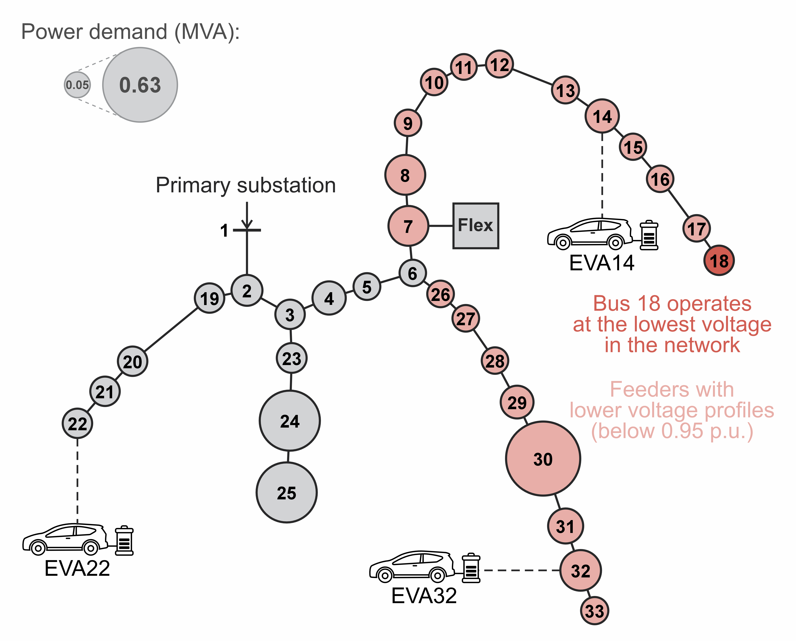
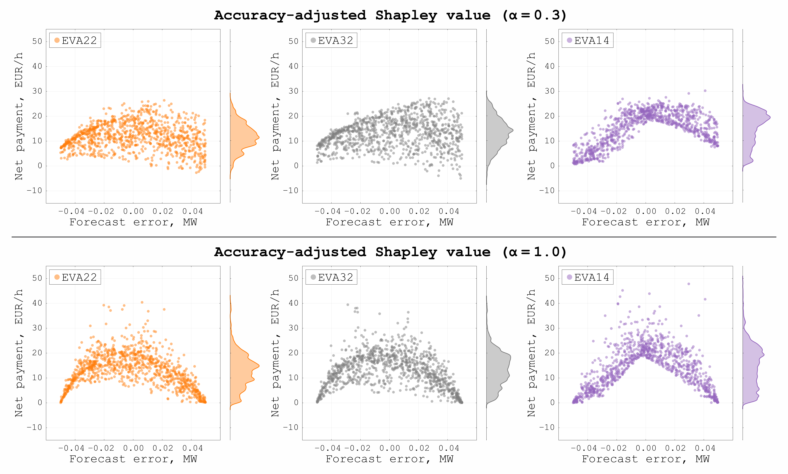

  

# ForecastVal-E
**Forecast VALuation for ENERGY data markets**

This project investigates data valuation challenges in distribution networks, with a focus on electric vehicle aggregator (EVA) load forecasting.
A two-stage forecast-sharing market is implemented to examine how forecast accuracy, location, and network constraints affect the value of EVA forecasts.
Several established value-oriented game-theoretic mechanisms are applied to remunerate forecast providers, including the Shapley value, the Nucleolus, and the leave-one-out (LOO) method.
The results show that network constraints, such as voltage limits, have a significant impact on the value of forecasts. Binding constraints partition system operation into distinct supply regimes, where different generators must be dispatched to maintain feasibility. Transitions between these regimes are costly, as they often require expensive balancing actions.
Consequently, the value of a given forecast depends on how it influences regime transitions, which is largely determined by the location of the provider. 

The figure below illustrates the forecast valuation framework for a two-settlement electricity market, where the circled numbers indicate the chronological order of valuation steps.

First, ①, in the day-ahead electricity market, each EVA submits its forecast of expected EV power consumption. This information is used by the system operator to determine the optimal day-ahead dispatch ②, including dispatch costs and commitments for the balancing market. These results, together with the EVA forecasts, are provided to the data market operator for valuation. Then, during real-time operation, actual EV loads are observed ③, and the system operator estimates the cost of balancing actions resulting from forecast errors ④. Finally, this information is submitted to the data marketplace, where the valuation mechanism determines payments for EVAs ⑤.

### EXAMPLES:
The forecast valuation framework is tested on the famous IEEE 33-bus test system, which represents a 12.66 kV radial distribution network with a total demand of 3.7 MW and 2.3 MVAr.
The system is visualised below as a graph where the size of the nodes is proportional to the nodal apparent power demand.
Three EVAs are placed in the network, connected to buses 22, 32, and 14. To avoid voltage violations and ensure feasible network operation, a flexible generator is connected to bus 7. This generator provides additional support when demand is high, supplying part of the load and alleviating voltage drops.

To investigate a realistic forecast-sharing market under uncertainty, a Monte Carlo analysis is performed. A total of 1000 scenarios are generated, where the load forecast of each EVA deviates from the observation by ±25%. Specifically, the load observations are assumed to be 0.20 MW per EVA, load forecasts are uniformly distributed within the range [0.15, 0.25] MW, and the baseline forecast is fixed at 0.10 MW per EVA.
Under these assumptions, all generated market instances result in a positive total avoided cost. That is, EVA forecasts collectively reduce the total system costs compared to the baseline forecasts. Scenarios with inaccurate or malicious forecasts that increase system costs are not considered.

The resulting allocations are visualised in the figure below. This figure illustrates the relationship between forecast errors and EVA payments, with negative values corresponding to penalties. The density plots on the right show the distributions of payments, from which the expected values can be derived. 

These results highlight the following key challenges in forecast valuation:
- The value of forecasts strongly depends on the provider's location and network constraints. In this example, EVA14 receives higher payments on average, while EVA22 and EVA32 may receive penalties even for accurate forecasts with low errors.
- The forecast-sharing market is not incentive compatible. For instance, the payment profile of EVA14 indicates a clear incentive to overestimate its load, that is, to report higher values. 
By doing so, EVA14 could systematically secure higher payments and avoid the region of load underestimation, where its payments are close to zero.

To address the issues of negative allocations and incentive incompatibility, the accuracy-adjusted Shapley value is applied to the same 1000 Monte Carlo scenarios. The results are presented in the figure below for different values of the parameter α, which determines the share of payments calculated based on forecast accuracy. When α is 0.3, payments are still largely shaped by the Shapley value allocations, reflecting the impact of network constraints and supply regimes. In contrast, when α is 1.0, payments are determined solely by forecast accuracy, resulting in a fully non-negative and symmetric allocation rule for all EVAs.

This illustrates how introducing an accuracy-based scoring can mitigate penalties for accurate forecasts and reduce sensitivity to network-induced asymmetries.
However, a purely accuracy-based valuation does not reflect the true monetary impact of EVA forecasts and the value of their locations. Therefore, a balance between accuracy-based and value-oriented approaches is required for practical implementation.

### RUNNING THE TOOL:
To be added...

`coalitional_analysis.jl` performs the coalitional analysis of EVA forecasts. Marginal contributions of players are estimated for each coalition. Then, several solution concepts are implemented to allocate the savings among forecast providers, including: the Shapley value, Nucleolus, and the LOO approach.

### AUTHORS:
The project is led by Dr. Andrey Churkin, Prof. Pierre Pinson, Prof. Janusz Bialek, and Dr. David Pozo.

### REFERENCES:
Some preliminary results have been presented at the International Symposium on Forecasting 2025: https://youtu.be/Ejhlk8N2Ftc

Other references to be added...
