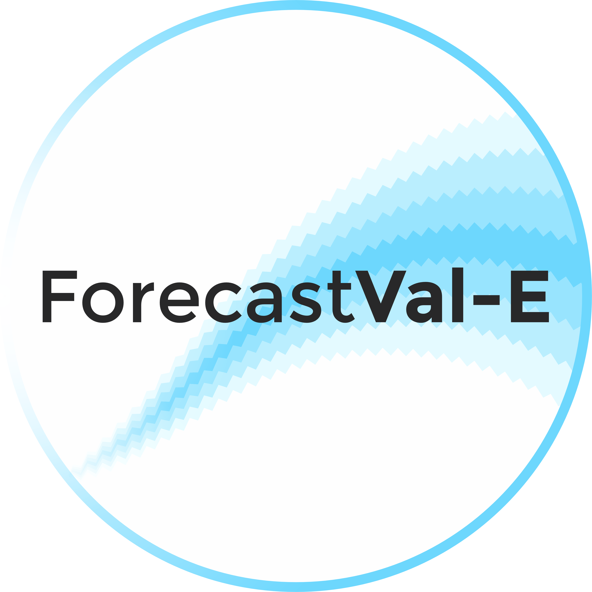
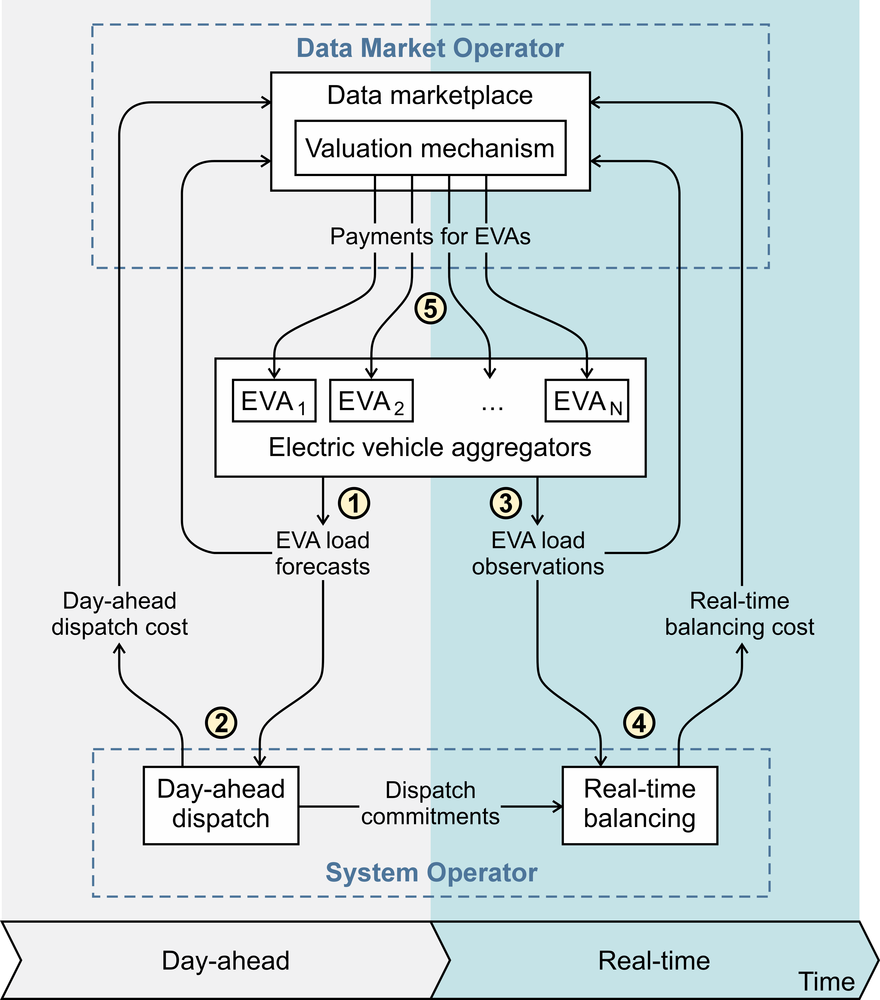

  

# ForecastVal-E
**Forecast VALuation for ENERGY data markets**

The figure below illustrates the forecast valuation framework for a two-settlement electricity market, where the circled numbers indicate the chronological order of valuation steps.

First, ①, in the day-ahead electricity market, each EVA submits its forecast of expected EV power consumption. This information is used by the system operator to determine the optimal day-ahead dispatch ②, including dispatch costs and commitments for the balancing market. These results, together with the EVA forecasts, are provided to the data market operator for valuation. Then, during real-time operation, actual EV loads are observed ③, and the system operator estimates the cost of balancing actions resulting from forecast errors ④. Finally, this information is submitted to the data marketplace, where the valuation mechanism determines payments for EVAs ⑤.

### EXAMPLES:
To be added...

### RUNNING THE TOOLS:
To be added...

### AUTHORS:
The project is led by Dr. Andrey Churkin, Prof. Pierre Pinson, Prof. Janusz Bialek, and Dr. David Pozo.

### REFERENCES:
Some preliminary results have been presented at the International Symposium on Forecasting 2025: https://youtu.be/Ejhlk8N2Ftc

Other references to be added...
